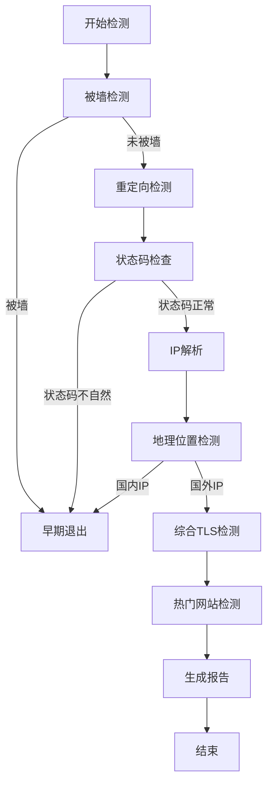
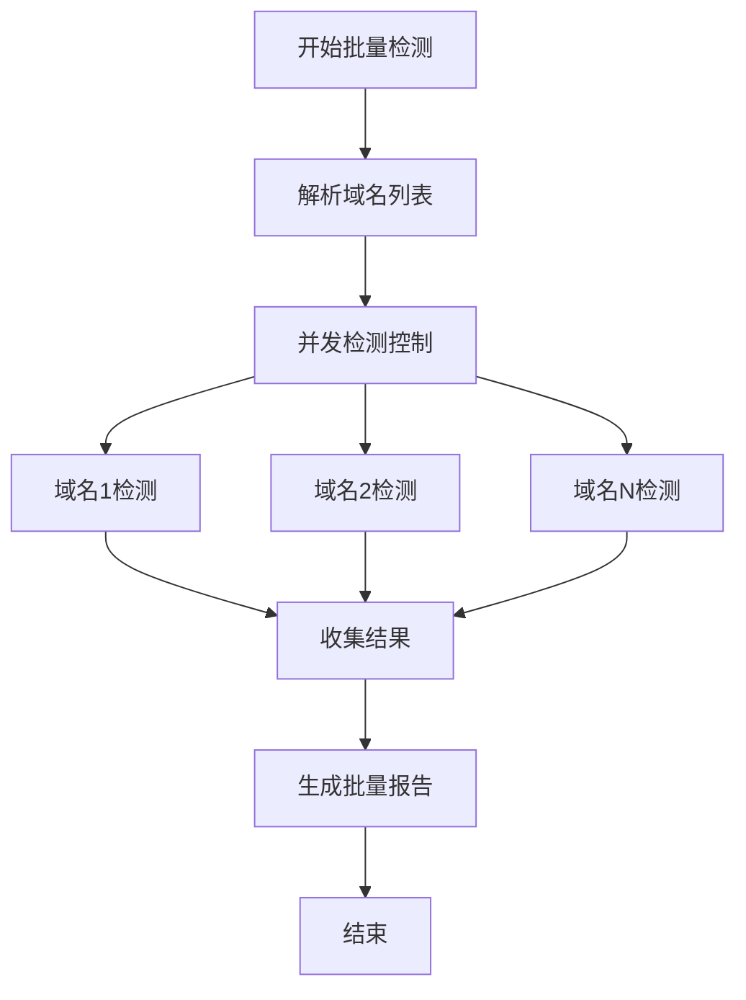

# Reality协议目标网站检测工具 - 技术文档

## 📋 目录

- [项目概述](#项目概述)
- [系统架构](#系统架构)
- [核心模块](#核心模块)
- [检测流程](#检测流程)
- [数据结构](#数据结构)
- [配置系统](#配置系统)
- [命令行接口](#命令行接口)
- [并发模型](#并发模型)
- [网络管理](#网络管理)
- [报告系统](#报告系统)
- [数据管理](#数据管理)
- [部署指南](#部署指南)
- [开发指南](#开发指南)

---

## 🎯 项目概述

**Reality协议目标网站检测工具** 是一个专业的网络检测工具，专门用于评估网站是否适合作为Reality协议的目标域名。该工具通过多维度检测，包括TLS协议支持、证书有效性、CDN使用情况、地理位置等，为用户提供全面的网站适用性分析。

### 核心特性

- **多维度检测**: TLS1.3、X25519、HTTP/2、SNI匹配、证书验证
- **智能CDN检测**: 基于多种方法的CDN识别，支持高/中/低置信度分级
- **地理位置分析**: 基于GeoIP的IP地理位置检测
- **被墙检测**: 基于GFWList的域名被墙状态检测
- **批量处理**: 支持多域名并发检测，优化检测效率
- **实时报告**: 生成详细的检测报告和推荐评级

### 技术栈

- **语言**: Go 1.21+
- **依赖管理**: Go Modules
- **网络库**: 标准库 `net/http`, `crypto/tls`
- **地理定位**: GeoIP2 (MaxMind)
- **表格渲染**: go-pretty
- **配置管理**: YAML
- **并发控制**: Goroutines + Channels

---

## 🏗️ 系统架构

### 整体架构图

```
┌─────────────────────────────────────────────────────────────┐
│                    RealityChecker                           │
├─────────────────────────────────────────────────────────────┤
│  CLI Layer (cmd/)                                           │
│  ├── root.go          # 根命令处理                         │
│  ├── check.go         # 单域名检测                         │
│  ├── batch.go         # 批量检测                           │
│  └── csv.go           # CSV文件检测                        │
├─────────────────────────────────────────────────────────────┤
│  Core Layer (core/)                                         │
│  ├── engine.go        # 主检测引擎                         │
│  └── pipeline.go      # 检测流水线                         │
├─────────────────────────────────────────────────────────────┤
│  Detection Layer (detectors/)                               │
│  ├── blocked.go       # 被墙检测                           │
│  ├── redirect.go      # 重定向检测                         │
│  ├── comprehensive_tls.go # 综合TLS检测                    │
│  ├── location.go      # 地理位置检测                       │
│  ├── hot_website.go   # 热门网站检测                       │
│  └── cdn.go           # CDN检测库                          │
├─────────────────────────────────────────────────────────────┤
│  Infrastructure Layer                                       │
│  ├── network/         # 网络连接管理                       │
│  ├── report/          # 报告格式化                         │
│  ├── config/          # 配置管理                           │
│  ├── data/            # 数据文件管理                       │
│  └── ui/              # 用户界面                           │
└─────────────────────────────────────────────────────────────┘
```

### 设计原则

1. **模块化设计**: 每个检测阶段独立，便于维护和扩展
2. **流水线架构**: 按优先级顺序执行检测，支持早期退出
3. **并发优化**: 多域名并发检测，单域名串行执行
4. **资源管理**: 连接池管理，避免资源泄露
5. **配置驱动**: 支持YAML配置文件，灵活调整参数

---

## 🔧 核心模块

### 1. 检测引擎 (core/engine.go)

**职责**: 统一管理检测流程，协调各个组件

```go
type Engine struct {
    config      *types.Config
    pipeline    *Pipeline
    connections *network.ConnectionManager
    mu          sync.RWMutex
    running     bool
}
```

**核心方法**:
- `Start()`: 启动引擎，初始化连接管理器
- `Stop()`: 停止引擎，清理资源
- `CheckDomain()`: 检测单个域名
- `CheckDomains()`: 批量检测域名

### 2. 检测流水线 (core/pipeline.go)

**职责**: 按优先级顺序执行检测阶段，实现早期退出机制

```go
type Pipeline struct {
    stages      []types.DetectionStage
    config      *types.Config
    earlyExit   bool
    connections *network.ConnectionManager
}
```

**检测阶段优先级**:
1. **被墙检测** (Priority: 1) - 最高优先级，被墙直接退出
2. **重定向检测** (Priority: 2) - 处理域名重定向
3. **状态码检查** (Priority: 3) - 验证HTTP状态码
4. **IP解析** (Priority: 4) - 解析域名IP地址
5. **地理位置检测** (Priority: 5) - 检测IP地理位置
6. **地理位置检查** (Priority: 6) - 验证是否为国内IP
7. **综合TLS检测** (Priority: 7) - TLS1.3、X25519、H2、SNI、证书
8. **热门网站检测** (Priority: 8) - 检测是否为热门网站

### 3. 综合TLS检测 (detectors/comprehensive_tls.go)

**职责**: 执行最关键的TLS相关检测，包括协议版本、加密套件、证书验证等

**检测流程**:
1. **第一次TLS握手**: 检测TLS1.3、HTTP/2、SNI匹配、证书有效性
2. **关键要求检查**: 如果任何关键要求失败，跳过X25519检测
3. **第二次TLS握手**: 专门检测X25519支持
4. **CDN检测**: 基于证书信息进行CDN检测

**关键检测项**:
- **TLS1.3支持**: 验证协议版本是否为TLS1.3
- **HTTP/2支持**: 通过ALPN协商检测H2支持
- **SNI匹配**: 验证证书主机名匹配
- **证书有效性**: 检查证书有效期、信任链、主机名验证
- **X25519支持**: 专门握手检测X25519椭圆曲线支持

---

## 🔄 检测流程

### 单域名检测流程



### 批量检测流程



### 早期退出机制

当检测到以下情况时，会立即终止后续检测：

1. **被墙检测**: 域名在GFWList中
2. **状态码检查**: HTTP状态码为401、403、407、408、429或5xx系列
3. **地理位置检查**: IP地址位于中国境内
4. **TLS关键要求**: TLS1.3、HTTP/2、SNI匹配、证书有效性任一失败

---

## 📊 数据结构

### 核心数据结构

#### DetectionResult - 检测结果

```go
type DetectionResult struct {
    Domain              string        `json:"domain"`
    Index               int           `json:"index"`
    StartTime           time.Time     `json:"start_time"`
    Duration            time.Duration `json:"duration"`
    Suitable            bool          `json:"suitable"`
    Error               error         `json:"error,omitempty"`
    HardRequirementsMet bool          `json:"hard_requirements_met"`
    EarlyExit           bool          `json:"early_exit"`
    StatusCodeCategory  string        `json:"status_code_category,omitempty"`

    // 检测结果
    Network     *NetworkResult     `json:"network,omitempty"`
    TLS         *TLSResult         `json:"tls,omitempty"`
    Certificate *CertificateResult `json:"certificate,omitempty"`
    SNI         *SNIResult         `json:"sni,omitempty"`
    CDN         *CDNResult         `json:"cdn,omitempty"`
    PageStatus  *PageStatusResult  `json:"page_status,omitempty"`
    Blocked     *BlockedResult     `json:"blocked,omitempty"`
    Location    *LocationResult    `json:"location,omitempty"`
    Summary     *DetectionSummary  `json:"summary,omitempty"`
}
```

#### TLSResult - TLS检测结果

```go
type TLSResult struct {
    ProtocolVersion string        `json:"protocol_version"`
    SupportsTLS13   bool          `json:"supports_tls13"`
    SupportsX25519  bool          `json:"supports_x25519"`
    SupportsHTTP2   bool          `json:"supports_http2"`
    CipherSuite     string        `json:"cipher_suite"`
    HandshakeTime   time.Duration `json:"handshake_time"`
}
```

#### CDNResult - CDN检测结果

```go
type CDNResult struct {
    IsCDN        bool   `json:"is_cdn"`
    CDNProvider  string `json:"cdn_provider"`
    Confidence   string `json:"confidence"`  // 高/中/低
    Evidence     string `json:"evidence"`
    IsHotWebsite bool   `json:"is_hot_website"`
    Error        error  `json:"error,omitempty"`
}
```

### 状态码分类

```go
const (
    StatusCodeCategorySafe     = "safe"     // 安全状态码：200, 301, 302, 404
    StatusCodeCategoryExcluded = "excluded" // 排除状态码：401, 403, 407, 408, 429, 5xx
    StatusCodeCategoryNetwork  = "network"  // 网络不可达
)
```

---

## ⚙️ 配置系统

### 配置文件结构 (config.yaml)

```yaml
network:
  timeout: 3s          # 网络超时时间
  retries: 1           # 重试次数
  dns_servers:         # DNS服务器列表
    - "8.8.8.8"
    - "1.1.1.1"

tls:
  min_version: 771     # TLS 1.2
  max_version: 772     # TLS 1.3

concurrency:
  max_concurrent: 8    # 最大并发数
  check_timeout: 3s    # 检测超时时间
  cache_ttl: 5m        # 缓存TTL

output:
  color: true          # 彩色输出
  verbose: false       # 详细输出
  format: "table"      # 输出格式

cache:
  dns_enabled: true    # DNS缓存启用
  result_enabled: true # 结果缓存启用
  ttl: 5m              # 缓存TTL
  max_size: 1000       # 最大缓存大小

batch:
  stream_output: false # 流式输出
  progress_bar: true   # 进度条
  report_format: "text" # 报告格式
  timeout: 30s         # 批量检测超时
```

### 配置加载机制

1. **默认配置**: 程序内置默认配置
2. **文件配置**: 支持从YAML文件加载配置
3. **配置合并**: 文件配置覆盖默认配置
4. **配置验证**: 自动验证和设置默认值

---

## 💻 命令行接口

### 命令结构

```
reality-checker <command> [arguments]
```

### 支持的命令

#### 1. 单域名检测

```bash
reality-checker check <domain>
```

**示例**:
```bash
reality-checker check apple.com
```

**功能**:
- 检测单个域名的适用性
- 显示详细的检测结果表格
- 提供推荐评级

#### 2. 批量检测

```bash
reality-checker batch <domain1> <domain2> <domain3> ...
```

**示例**:
```bash
reality-checker batch apple.com google.com microsoft.com
```

**功能**:
- 并发检测多个域名
- 显示实时进度
- 生成批量检测报告
- 按推荐星级排序

#### 3. CSV文件检测

```bash
reality-checker csv <csv_file>
```

**示例**:
```bash
reality-checker csv domains.csv
```

**功能**:
- 从CSV文件读取域名列表
- 批量检测所有域名
- 生成详细的批量报告

#### 4. 版本信息

```bash
reality-checker version
reality-checker -v
reality-checker --version
```

**功能**:
- 显示程序版本信息
- 显示构建时间和提交哈希

### 错误处理

程序提供详细的错误信息和解决建议：

```bash
# 缺少参数
reality-checker check
# 输出: 错误：缺少域名参数
#       用法: reality-checker check <domain>
#       示例: reality-checker check apple.com

# 文件不存在
reality-checker csv nonexistent.csv
# 输出: 错误：CSV文件不存在 'nonexistent.csv'
#       请使用 RealiTLScanner 工具扫描，得到 CSV 文件
#       命令：./RealiTLScanner -addr <VPS IP> -port 443 -thread 100 -timeout 5 -out file.csv
```

---

## 🚀 并发模型

### 并发设计原则

1. **多域名并发**: 不同域名可以同时检测
2. **单域名串行**: 同一域名的检测阶段必须按顺序执行
3. **资源管理**: 合理控制并发数量，避免资源耗尽
4. **连接复用**: 在单域名内复用连接，减少重复握手

### 并发控制机制

#### 信号量控制

```go
// 使用信号量控制并发数
concurrency := int(bm.config.Concurrency.MaxConcurrent) // 默认8个
semaphore := make(chan struct{}, concurrency)

for i, domain := range domains {
    wg.Add(1)
    go func(index int, domain string) {
        defer wg.Done()
        
        // 获取信号量
        select {
        case semaphore <- struct{}{}:
            defer func() { <-semaphore }()
        case <-ctx.Done():
            return
        }
        
        // 执行检测
        result, err := bm.engine.CheckDomain(ctx, domain)
        // ...
    }(i, domain)
}
```

#### 上下文取消

```go
// 支持优雅取消
ctx, cancel := context.WithCancel(context.Background())
go func() {
    sigChan := make(chan os.Signal, 1)
    signal.Notify(sigChan, syscall.SIGINT, syscall.SIGTERM)
    <-sigChan
    cancel()
}()
```

### 性能优化

#### 自适应并发数

```go
func (bm *Manager) calculateOptimalConcurrency(domainCount int) int {
    if domainCount <= 5 {
        return domainCount // 小批量：每个域名一个并发
    } else if domainCount <= 20 {
        return 6 // 中小批量：6个并发
    } else if domainCount <= 50 {
        return 8 // 中批量：8个并发
    } else if domainCount <= 100 {
        return 10 // 大批量：10个并发
    } else {
        return 12 // 超大批量：最多12个并发
    }
}
```

---

## 🌐 网络管理

### 连接管理器 (network/manager.go)

**职责**: 管理HTTP和TLS连接，提供连接池和资源清理

```go
type ConnectionManager struct {
    config          *types.Config
    httpConnections map[string]*HTTPConnectionPool
    tlsConnections  map[string]*TLSConnectionPool
    mu              sync.RWMutex
    stats           *types.ConnectionStats
}
```

### 连接类型

#### 1. HTTP连接

```go
func (cm *ConnectionManager) GetHTTPConnection(ctx context.Context, domain string) (net.Conn, error) {
    const httpPort = ":80"
    conn, err := net.DialTimeout("tcp", domain+httpPort, cm.config.Network.Timeout)
    // ...
}
```

#### 2. 标准TLS连接

```go
func (cm *ConnectionManager) GetTLSConnection(ctx context.Context, domain string) (*tls.Conn, error) {
    const tlsPort = ":443"
    tcpConn, err := net.DialTimeout("tcp", domain+tlsPort, cm.config.Network.Timeout)
    
    tlsConn := tls.Client(tcpConn, &tls.Config{
        ServerName: domain,
        NextProtos: []string{"h2", "http/1.1"}, // h2优先
    })
    // ...
}
```

#### 3. 强制X25519 TLS连接

```go
func (cm *ConnectionManager) GetX25519TLSConnection(ctx context.Context, domain string) (*tls.Conn, error) {
    tlsConn := tls.Client(tcpConn, &tls.Config{
        ServerName:       domain,
        NextProtos:       []string{"h2", "http/1.1"},
        CurvePreferences: []tls.CurveID{tls.X25519}, // 强制X25519
    })
    // ...
}
```

### 连接清理

```go
func (cm *ConnectionManager) cleanupConnections() {
    ticker := time.NewTicker(30 * time.Second)
    defer ticker.Stop()

    for range ticker.C {
        // 清理超过5分钟的连接池
        for domain, pool := range cm.httpConnections {
            if now.Sub(pool.created) > 5*time.Minute {
                // 关闭所有连接并删除池
            }
        }
    }
}
```

---

## 📋 报告系统

### 报告格式化器 (report/)

#### 1. 表格格式化器 (table_formatter.go)

**功能**: 生成美观的表格输出，支持颜色和样式

```go
type TableFormatter struct {
    config *types.Config
}
```

**表格列结构**:
- **最终域名**: 重定向后的最终域名
- **基础条件**: TLS1.3 + X25519 + H2 + SNI匹配的综合状态
- **握手时间**: TLS握手耗时
- **证书时间**: 证书剩余有效天数
- **CDN**: CDN检测结果和置信度
- **热门**: 是否为热门网站
- **推荐**: 推荐星级 (1-5星)
- **页面状态**: HTTP状态码

#### 2. 报告格式化器 (formatter.go)

**功能**: 生成详细的文本报告

```go
type Formatter struct {
    config *types.Config
}
```

### 推荐评级算法

```go
func (tf *TableFormatter) calculateRecommendationStars(result *types.DetectionResult) string {
    stars := 5 // 基础5星
    
    // CDN扣分
    if result.CDN != nil && result.CDN.IsCDN {
        switch result.CDN.Confidence {
        case "高":
            stars -= 2
        case "中":
            stars -= 1
        case "低":
            stars -= 1
        }
    }
    
    // 热门网站扣分
    if result.CDN != nil && result.CDN.IsHotWebsite {
        stars -= 1
    }
    
    // 确保至少1星
    if stars < 1 {
        stars = 1
    }
    
    return strings.Repeat("★", stars) + strings.Repeat("☆", 5-stars)
}
```

### 批量报告

批量检测会生成包含以下内容的综合报告：

1. **统计摘要**: 总域名数、成功率、适合性率
2. **适合域名表格**: 按推荐星级排序的适合域名
3. **不适合域名汇总**: 按失败原因分组的统计
4. **状态码分析**: 状态码不自然域名的详细分析

---

## 📁 数据管理

### 数据文件下载器 (data/downloader.go)

**职责**: 自动下载和更新必要的数据文件

#### 支持的数据文件

1. **cdn_keywords.txt**: CDN检测关键词库
2. **hot_websites.txt**: 热门网站列表
3. **gfwlist.conf**: GFW被墙域名列表
4. **Country.mmdb**: GeoIP地理位置数据库

#### 自动更新机制

```go
func (d *Downloader) EnsureDataFiles() error {
    files := []DataFile{
        {
            Name:      "cdn_keywords.txt",
            URL:       "https://raw.githubusercontent.com/V2RaySSR/RealityChecker/main/data/cdn_keywords.txt",
            LocalPath: "data/cdn_keywords.txt",
        },
        // ...
    }
    
    for _, file := range files {
        if err := d.ensureFile(file); err != nil {
            return err
        }
    }
    return nil
}
```

#### 更新策略

- **首次运行**: 自动下载所有必要文件
- **定期更新**: 文件超过3天自动更新
- **失败重试**: 下载失败时重试3次
- **手动下载**: 提供手动下载说明

---

## 🚀 部署指南

### 系统要求

- **操作系统**: Linux (推荐), Windows, macOS
- **架构**: x86_64, ARM64
- **内存**: 最少64MB，推荐128MB+
- **网络**: 需要访问HTTPS网站和GitHub

### 安装方法

#### 方法1: 直接下载 (推荐)

```bash
# Linux x86_64
wget https://github.com/V2RaySSR/RealityChecker/releases/latest/download/reality-checker-linux-amd64.zip
unzip reality-checker-linux-amd64.zip
chmod +x reality-checker

# Linux ARM64
wget https://github.com/V2RaySSR/RealityChecker/releases/latest/download/reality-checker-linux-arm64.zip
unzip reality-checker-linux-arm64.zip
chmod +x reality-checker
```

#### 方法2: 源码编译

```bash
# 克隆仓库
git clone https://github.com/V2RaySSR/RealityChecker.git
cd RealityChecker

# 编译
go build -o reality-checker

# 运行
./reality-checker check apple.com
```

### 配置文件

创建 `config.yaml` 文件自定义配置：

```yaml
network:
  timeout: 5s
  retries: 2

concurrency:
  max_concurrent: 10

output:
  color: true
  verbose: false
```

### 数据文件

程序首次运行会自动下载必要的数据文件到 `data/` 目录：

```
data/
├── cdn_keywords.txt    # CDN检测关键词
├── hot_websites.txt    # 热门网站列表
├── gfwlist.conf        # GFW被墙列表
└── Country.mmdb        # GeoIP数据库
```

### 权限设置

```bash
# 确保程序有执行权限
chmod +x reality-checker

# 确保data目录可写
chmod 755 data/
```

---

## 🛠️ 开发指南

### 项目结构

```
RealityChecker/
├── main.go                    # 程序入口
├── go.mod                     # Go模块文件
├── go.sum                     # 依赖校验文件
├── config.yaml                # 配置文件
├── data/                      # 数据文件目录
│   ├── cdn_keywords.txt
│   ├── hot_websites.txt
│   ├── gfwlist.conf
│   └── Country.mmdb
├── internal/                  # 内部包
│   ├── cmd/                   # 命令行接口
│   │   ├── root.go
│   │   ├── check.go
│   │   ├── batch.go
│   │   └── csv.go
│   ├── core/                  # 核心引擎
│   │   ├── engine.go
│   │   └── pipeline.go
│   ├── detectors/             # 检测器
│   │   ├── blocked.go
│   │   ├── redirect.go
│   │   ├── comprehensive_tls.go
│   │   ├── location.go
│   │   ├── hot_website.go
│   │   └── cdn.go
│   ├── network/               # 网络管理
│   │   └── manager.go
│   ├── report/                # 报告系统
│   │   ├── formatter.go
│   │   └── table_formatter.go
│   ├── config/                # 配置管理
│   │   └── config.go
│   ├── data/                  # 数据管理
│   │   └── downloader.go
│   ├── ui/                    # 用户界面
│   │   ├── banner.go
│   │   └── display.go
│   └── types/                 # 类型定义
│       └── types.go
└── .github/                   # GitHub Actions
    └── workflows/
        └── build.yml
```

### 开发环境设置

```bash
# 安装Go 1.21+
go version

# 克隆项目
git clone https://github.com/V2RaySSR/RealityChecker.git
cd RealityChecker

# 安装依赖
go mod tidy

# 运行测试
go test ./...

# 构建项目
go build -o reality-checker
```

### 添加新的检测阶段

1. **实现DetectionStage接口**:

```go
type MyDetectionStage struct {
    // 检测器特定字段
}

func (m *MyDetectionStage) Execute(ctx *types.PipelineContext) error {
    // 实现检测逻辑
    return nil
}

func (m *MyDetectionStage) CanEarlyExit() bool {
    return true // 或 false
}

func (m *MyDetectionStage) Priority() int {
    return 5 // 设置优先级
}

func (m *MyDetectionStage) Name() string {
    return "MyDetection"
}
```

2. **注册到流水线**:

```go
// 在 pipeline.go 的 initializeStages 方法中添加
pipeline.stages = []types.DetectionStage{
    // ... 其他阶段
    detectors.NewMyDetectionStage(), // 新检测阶段
}
```

### 测试指南

```bash
# 运行所有测试
go test ./...

# 运行特定包的测试
go test ./internal/detectors/

# 运行带详细输出的测试
go test -v ./...

# 运行基准测试
go test -bench=. ./...
```

### 代码规范

1. **命名规范**: 使用驼峰命名法，公开函数首字母大写
2. **错误处理**: 使用 `fmt.Errorf` 包装错误信息
3. **并发安全**: 使用 `sync.RWMutex` 保护共享资源
4. **资源清理**: 使用 `defer` 确保资源正确释放
5. **注释规范**: 公开函数必须有注释说明

### 提交规范

```bash
# 提交信息格式
<type>(<scope>): <description>

# 示例
feat(detectors): 添加新的CDN检测方法
fix(network): 修复连接泄露问题
docs(readme): 更新安装说明
```

---

## 📝 总结

Reality协议目标网站检测工具是一个设计精良、功能完善的网络检测工具。通过模块化的架构设计、高效的并发模型、智能的检测算法，为用户提供了专业级的网站适用性分析能力。

### 主要优势

1. **科学架构**: 流水线式检测，支持早期退出，提高效率
2. **全面检测**: 覆盖TLS、证书、CDN、地理位置等多个维度
3. **高效并发**: 多域名并发检测，单域名串行执行
4. **智能报告**: 基于多维度分析的推荐评级系统
5. **易于使用**: 简洁的命令行接口，详细的错误提示
6. **可扩展性**: 模块化设计，便于添加新的检测功能

### 技术亮点

- **X25519检测**: 专门的双握手机制，确保检测准确性
- **CDN智能识别**: 多方法融合，支持置信度分级
- **连接管理**: 高效的连接池和资源清理机制
- **配置驱动**: 灵活的YAML配置系统
- **自动更新**: 智能的数据文件管理

该工具为Reality协议用户提供了可靠的目标域名选择依据，帮助用户做出更明智的配置决策。

