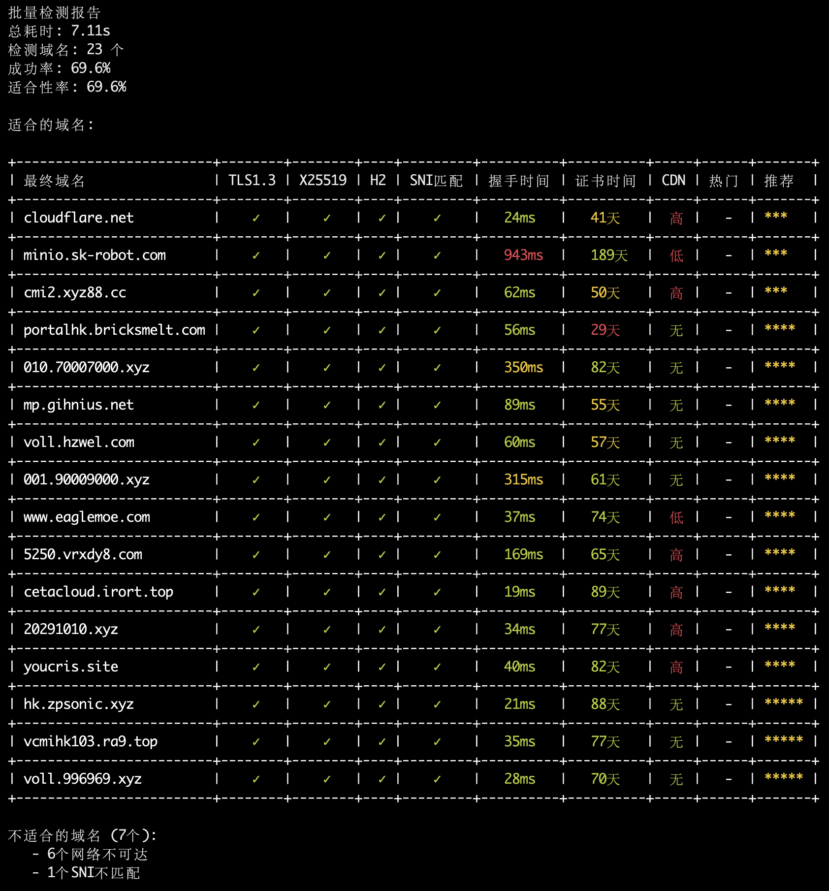

# Reality协议目标网站检测工具

一个专业的Reality协议目标网站检测工具，用于评估网站是否适合作为Reality协议的目标域名。

[V2RaySSR综合网](https://v2rayssr.com)

## ✨ 功能特性

* **被墙检测** - 基于GFWList检测网站是否被墙
* **地理位置检测** - 检测IP地理位置，国内网站直接终止
* **TLS协议检测** - 检测TLS 1.3和X25519支持
* **证书检测** - 检测证书有效性和SNI匹配
* **CDN检测** - 智能检测CDN使用情况
* **热门网站检测** - 检测是否为热门网站
* **重定向检测** - 检测域名重定向
* **批量检测** - 支持多域名并发检测，可与RealiTLScanner配合使用
* **智能报告** - 生成详细的检测分析报告

## 📊 检测结果说明

### 检测结果示例

以下是一个批量检测的实际输出示例：

```bash
./reality-checker csv file.csv
```

**实际运行效果：**



**只有满足Reality目标域名硬性条件的（TLS1.3、X25519、H2、SNI匹配、证书有效），才会在列表中显示**

### CDN检测等级说明

| 等级 | 含义 | 影响 |
|------|------|------|
| **高** | 明确使用CDN | 可以使用，但不推荐 |
| **中** | 疑似使用CDN | 可以使用，但不推荐 |
| **低** | 轻微CDN特征 | 可以使用，但不推荐 |
| **-** | 未检测到CDN | 可以使用，强烈推荐 |

### 热门网站说明

热门网站（如 apple.com、tesla.com、microsoft.com 等）由于使用人群多，容易被识别和封禁，因此不太推荐作为 Reality 协议的目标域名。

**结果分析：**
- 所有域名都支持TLS 1.3、X25519、HTTP/2和SNI匹配
- 证书有效期充足
- 部分使用了CDN且为热门网站
- 部分虽然技术指标优秀，但由于CDN和热门网站特性，推荐度有所降低


## 🚀 快速开始

### 系统要求

* **Linux VPS** - 主要针对VPS环境使用
* **Windows、macOS** - 等自行编译
* **Go 1.21+** - 用于本地编译（Windows、macOS可选）

### 安装步骤

**方法1：直接下载（推荐）**

从 [Releases](https://github.com/V2RaySSR/RealityChecker/releases) 页面下载对应架构的zip文件：

```bash
# Linux x86_64
wget https://github.com/V2RaySSR/RealityChecker/releases/latest/download/reality-checker-linux-amd64.zip

# Linux ARM64
wget https://github.com/V2RaySSR/RealityChecker/releases/latest/download/reality-checker-linux-arm64.zip
```

解压后直接使用：
```bash
# 解压
unzip reality-checker-linux-amd64.zip

# 添加执行权限
chmod +x reality-checker

# 开始检测
./reality-checker check <域名>
```

**方法2：本地编译**

```bash
# 克隆项目
git clone https://github.com/V2RaySSR/RealityChecker.git
cd RealityChecker

# 编译程序
go build -o reality-checker

# 开始检测
./reality-checker check <域名>
```

## 🔍 使用示例

### 单域名检测

```bash
# 基础检测
./reality-checker check apple.com
```

### 批量检测

```bash
# 批量检测多个域名（空格分隔）
./reality-checker batch apple.com tesla.com microsoft.com
```

### CSV文件检测

```bash
# 从CSV文件批量检测域名
./reality-checker csv file.csv
```

### 推荐工作流程

对于大量域名检测，建议配合使用 [RealiTLScanner](https://github.com/XTLS/RealiTLScanner) 工具：

**1. 使用RealiTLScanner扫描VPS IP：**
```bash
./RealiTLScanner -addr <VPS IP> -port 443 -thread 100 -timeout 5 -out file.csv
```

**2. 使用本工具检测生成的CSV文件：**
```bash
./reality-checker csv file.csv
```

**重要提示：**
- RealiTLScanner 尽量在本地运行，不要在远端
- 多次运行RealiTLScanner时，请更改输出文件名，如：`file1.csv`、`file2.csv`、`file3.csv` 等
- 如果使用相同的文件名，可能会导致文件导出失败或覆盖之前的扫描结果

### 查看帮助

```bash
# 显示使用说明
./reality-checker

# 查看版本信息
./reality-checker version
```

## 🔧常见问题

**1. 数据文件下载失败**

如果自动下载失败，请手动下载以下文件到 `data/` 目录：

- [Country.mmdb](https://github.com/Loyalsoldier/geoip/releases/latest/download/Country.mmdb)
- [gfwlist.conf](https://raw.githubusercontent.com/Loyalsoldier/clash-rules/release/gfw.txt)
- [cdn_keywords.txt](https://raw.githubusercontent.com/V2RaySSR/RealityChecker/main/data/cdn_keywords.txt)
- [hot_websites.txt](https://raw.githubusercontent.com/V2RaySSR/RealityChecker/main/data/hot_websites.txt)


## 🏆 致谢

感谢以下开源项目：

* [Loyalsoldier/geoip](https://github.com/Loyalsoldier/geoip) - GeoIP数据库
* [Loyalsoldier/clash-rules](https://github.com/Loyalsoldier/clash-rules) - GFW规则

---

**注意**: 本工具仅用于技术研究和学习目的，请遵守当地法律法规，合理使用网络资源。